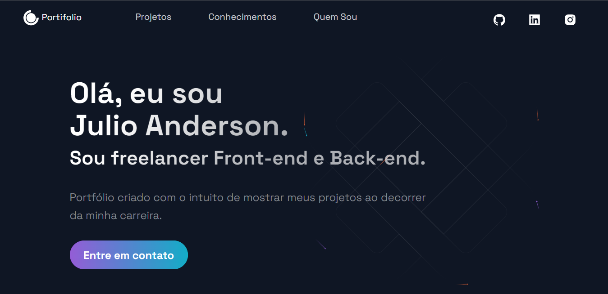

<h1 align="center">
  📰 Meu Portfólio
</h1>

<h4 align="center">
  Portfólio criado com o intuito de mostrar meus projetos ao decorrer da minha carreira.
</h4>

<h4 align="center"><a href="https://www.andersoncode.com/">Clique para visitar o projeto</a></h4>

##  📌 Ajustes e melhorias
 
 - [ ] Criar logo
 - [ ] Adicionar Página de Serviços
 - [ ] Adicionar Página Para Solicitar Orcamentos
 - [ ] Melhorar o Footer

---

## 💼 Tecnologias utilizadas
Para o desenvolvimento deste site utilizei as seguintes tecnologias:

- NextJs;
- Styled Components;
- Styled Normalize;
- JavaScript;
- ReactJs;

---

## 🦄 Autor 
<tab>
  <tr>
    <td align="center">
      <a href="https://github.com/kbaths">
         
        
          <b>Julio Anderson</b>
        
      </a>
    </td>
  </tr>
</tab